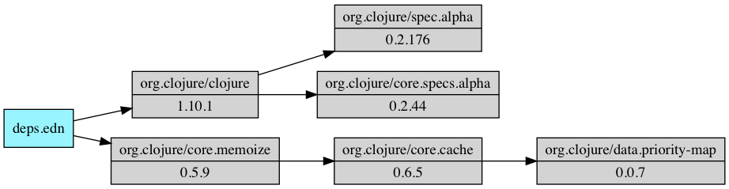

tools.deps.graph
========================================

A tool for making deps.edn dependency graphs.



# Dependencies

tools.deps.graph uses [Graphviz](https://www.graphviz.org/) to generate images. You can find a list of platform-specific installations at https://graphviz.gitlab.io/download/.

# Usage

Add tools.deps.graph as an alias in your ~/.clojure/deps.edn so it's available in any project:

```clojure
{...
 :aliases
 {:graph {:replace-deps {org.clojure/tools.deps.graph {:mvn/version "1.0.56"}}
          :main-opts ["-m" "clojure.tools.deps.graph"] ;; deprecated
          :ns-default clojure.tools.deps.graph}}}
```

tools.deps.graph supports both older clojure.main invocation (deprecated) and newer exec function invocation (clj -X).

To run with exec in your current project:

```
clj -X:graph graph <options>
```

Older clojure.main invocation in your current project (use -M for clj 1.10.1.697+, -A for older):

```
clj -M:graph <options>
```

If no options are provided, tools.deps.graph will create a dependency graph for the current project and display it. Ctrl-C to quit.

When using -X, options:

* `:deps` - Path to deps file (default = "deps.edn")
* `:trace` - Boolean flag to use trace mode (default = false)
* `:trace-file` - Path to trace.edn file to read
* `:output` - Output file path
* `:trace-omit` - Collection of lib symbols to omit in trace output
* `:size` - Boolean flag to include sizes in images (default = false)

Equivalent clojure.main options:

* -d DEPSFILE - deps.edn file to read, default=deps.edn
* -t - Trace mode, will output one image per expansion step
* -f TRACEFILE - Trace file mode - read trace file, don't use deps.edn file
* -o FILE - Output file, in trace mode, required and will create N images with this as a prefix
* -a - Concatenated alias names to enable when reading deps file
* --trace-omit - Comma-delimited list of libs to skip in trace images"
* --size- Add jar size info to dep graph"

# Examples

Show dependency graph for current project:

```
clj -X:graph graph
```

Save dependency graph to deps.png for current project:

```
clj -X:graph graph :output '"deps.png"'
```

Show dependency graph for current project with jar sizes:

```
clj -X:graph graph :output '"deps.png"' :size true
```

Read mydeps.edn, create deps graph, output image to mydeps.png:

```
clj -X:graph graph :deps '"mydeps.edn"' :output '"mydeps.png"'
```

Read deps.edn, trace expansion, output steps as trace100.png, trace101.png, ... :

```
clj -X:graph graph :trace true :output '"trace"'
```

Read mydeps.edn, trace expansion, output trace100.png, ... :

```
clj -X:graph graph :deps '"mydeps.edn"' :trace true :output '"trace"'
```

Use -Strace to output a trace.edn file.
Read trace.edn file, output trace100.png, ...

```
clj -Strace
clj -X:graph graph :trace-file '"trace.edn"' :output '"trace"'
```

# Release Information

This project follows the version scheme MAJOR.MINOR.COMMITS where MAJOR and MINOR provide some relative indication of the size of the change, but do not follow semantic versioning. In general, all changes endeavor to be non-breaking (by moving to new names rather than by breaking existing names). COMMITS is an ever-increasing counter of commits since the beginning of this repository.

Latest release: 1.0.56

* [All released versions](http://search.maven.org/#search%7Cgav%7C1%7Cg%3A%22org.clojure%22%20AND%20a%3A%22tools.deps.graph%22)

[deps.edn](https://clojure.org/guides/deps_and_cli) dependency information:

```
org.clojure/tools.deps.graph {:mvn/version "1.0.56"}
```

# Developer Information

* [GitHub project](https://github.com/clojure/tools.deps.graph)
* [How to contribute](https://clojure.org/community/contributing)
* [Bug Tracker](https://dev.clojure.org/jira/browse/TDEPS)
* [Continuous Integration](https://build.clojure.org/job/tools.deps.graph/)
* [Compatibility Test Matrix](https://build.clojure.org/job/tools.deps.graph-test-matrix/)

# Copyright and License

Copyright © 2019 Rich Hickey, Alex Miller, and contributors

All rights reserved. The use and
distribution terms for this software are covered by the
[Eclipse Public License 1.0] which can be found in the file
epl-v10.html at the root of this distribution. By using this software
in any fashion, you are agreeing to be bound by the terms of this
license. You must not remove this notice, or any other, from this
software.

[Eclipse Public License 1.0]: http://opensource.org/licenses/eclipse-1.0.php
